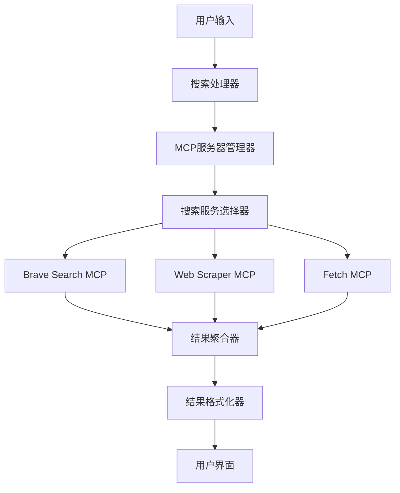

# 网络搜索集成功能设计文档

## 概述

本设计文档描述了如何在Kiro IDE中集成可靠的网络搜索功能，包括MCP服务器配置、搜索接口设计和用户体验优化。

## 架构

### 整体架构图



### 组件层次结构

1. **用户界面层**
   - 搜索输入组件
   - 结果显示组件
   - 配置管理界面

2. **业务逻辑层**
   - 搜索处理器
   - 结果聚合器
   - 缓存管理器

3. **服务层**
   - MCP服务器管理器
   - 搜索服务适配器
   - 错误处理器

4. **数据层**
   - 搜索历史存储
   - 结果缓存
   - 配置存储

## 组件和接口

### 1. MCP服务器配置

#### 推荐的MCP服务器配置

```json
{
  "mcpServers": {
    "brave-search": {
      "command": "uvx",
      "args": ["mcp-server-brave-search@latest"],
      "env": {
        "BRAVE_API_KEY": "${BRAVE_API_KEY}"
      },
      "disabled": false,
      "autoApprove": ["brave_web_search", "brave_news_search"]
    },
    "web-fetch": {
      "command": "uvx", 
      "args": ["mcp-server-fetch@latest"],
      "disabled": false,
      "autoApprove": ["fetch"]
    },
    "puppeteer-scraper": {
      "command": "uvx",
      "args": ["mcp-server-puppeteer@latest"],
      "disabled": false,
      "autoApprove": ["puppeteer_navigate", "puppeteer_screenshot"]
    }
  }
}
```

### 2. 搜索接口设计

#### SearchService接口

```typescript
interface SearchService {
  search(query: string, options?: SearchOptions): Promise<SearchResult[]>;
  searchNews(query: string, options?: NewsSearchOptions): Promise<NewsResult[]>;
  isAvailable(): Promise<boolean>;
  getServiceName(): string;
}

interface SearchOptions {
  maxResults?: number;
  language?: 'zh' | 'en';
  region?: string;
  safeSearch?: boolean;
}

interface SearchResult {
  title: string;
  url: string;
  snippet: string;
  source: string;
  publishedAt?: Date;
  relevanceScore?: number;
}
```

#### MCP服务器适配器

```typescript
class BraveSearchAdapter implements SearchService {
  async search(query: string, options?: SearchOptions): Promise<SearchResult[]> {
    // 调用Brave Search MCP服务器
  }
  
  async searchNews(query: string, options?: NewsSearchOptions): Promise<NewsResult[]> {
    // 调用Brave News Search
  }
}

class WebFetchAdapter implements SearchService {
  async search(query: string, options?: SearchOptions): Promise<SearchResult[]> {
    // 使用fetch MCP服务器获取搜索引擎结果页面
    // 解析HTML内容提取搜索结果
  }
}
```

### 3. 搜索处理流程

#### 搜索请求处理

```typescript
class SearchProcessor {
  private services: SearchService[] = [];
  private cache: SearchCache;
  
  async processSearch(query: string): Promise<SearchResult[]> {
    // 1. 检查缓存
    const cached = await this.cache.get(query);
    if (cached && !this.isCacheExpired(cached)) {
      return cached.results;
    }
    
    // 2. 选择可用的搜索服务
    const service = await this.selectAvailableService();
    
    // 3. 执行搜索
    const results = await service.search(query);
    
    // 4. 缓存结果
    await this.cache.set(query, results);
    
    // 5. 返回格式化结果
    return this.formatResults(results);
  }
}
```

### 4. 错误处理策略

#### 服务降级机制

```typescript
class SearchServiceManager {
  private primaryService: SearchService;
  private fallbackServices: SearchService[];
  
  async search(query: string): Promise<SearchResult[]> {
    try {
      return await this.primaryService.search(query);
    } catch (error) {
      console.warn('Primary search service failed:', error);
      
      for (const fallback of this.fallbackServices) {
        try {
          return await fallback.search(query);
        } catch (fallbackError) {
          console.warn('Fallback service failed:', fallbackError);
        }
      }
      
      throw new Error('All search services are unavailable');
    }
  }
}
```

## 数据模型

### 搜索结果模型

```typescript
interface SearchResult {
  id: string;
  title: string;
  url: string;
  snippet: string;
  source: string;
  publishedAt?: Date;
  imageUrl?: string;
  relevanceScore: number;
  searchEngine: string;
}

interface NewsResult extends SearchResult {
  category: string;
  author?: string;
  summary: string;
}

interface SearchHistory {
  id: string;
  query: string;
  timestamp: Date;
  resultCount: number;
  searchEngine: string;
}
```

### 配置模型

```typescript
interface SearchConfiguration {
  defaultSearchEngine: string;
  maxResults: number;
  cacheExpiration: number;
  enabledServices: string[];
  searchPreferences: {
    language: string;
    region: string;
    safeSearch: boolean;
  };
}
```

## 错误处理

### 错误类型定义

```typescript
enum SearchErrorType {
  NETWORK_ERROR = 'NETWORK_ERROR',
  API_LIMIT_EXCEEDED = 'API_LIMIT_EXCEEDED',
  INVALID_QUERY = 'INVALID_QUERY',
  SERVICE_UNAVAILABLE = 'SERVICE_UNAVAILABLE',
  AUTHENTICATION_FAILED = 'AUTHENTICATION_FAILED'
}

class SearchError extends Error {
  constructor(
    public type: SearchErrorType,
    message: string,
    public originalError?: Error
  ) {
    super(message);
  }
}
```

### 错误处理策略

1. **网络错误**: 自动重试3次，间隔递增
2. **API限制**: 切换到备用服务或显示限制信息
3. **认证失败**: 提示用户检查API密钥配置
4. **服务不可用**: 使用备用搜索服务
5. **无效查询**: 提供查询建议和格式指导

## 测试策略

### 单元测试

1. **搜索服务适配器测试**
   - 模拟MCP服务器响应
   - 测试错误处理逻辑
   - 验证结果格式化

2. **缓存机制测试**
   - 测试缓存存储和检索
   - 验证缓存过期逻辑
   - 测试缓存清理功能

### 集成测试

1. **MCP服务器连接测试**
   - 验证服务器启动和连接
   - 测试服务器重连机制
   - 验证配置更新处理

2. **端到端搜索测试**
   - 测试完整搜索流程
   - 验证结果显示和交互
   - 测试多语言搜索支持

### 性能测试

1. **响应时间测试**
   - 搜索请求响应时间 < 5秒
   - 缓存命中响应时间 < 500ms
   - 并发搜索处理能力

2. **资源使用测试**
   - 内存使用监控
   - 网络带宽使用
   - CPU使用率测试

## 部署和配置

### 环境变量配置

```bash
# Brave Search API密钥
BRAVE_API_KEY=your_brave_api_key_here

# 搜索配置
SEARCH_CACHE_TTL=3600
SEARCH_MAX_RESULTS=20
SEARCH_DEFAULT_LANGUAGE=zh
```

### MCP服务器部署

1. **自动安装脚本**
   ```bash
   # 安装必要的MCP服务器
   uvx install mcp-server-brave-search@latest
   uvx install mcp-server-fetch@latest
   uvx install mcp-server-puppeteer@latest
   ```

2. **配置验证**
   - 检查uvx是否已安装
   - 验证MCP服务器包的可用性
   - 测试服务器连接

### 监控和日志

1. **搜索性能监控**
   - 搜索请求数量和成功率
   - 平均响应时间
   - 错误率统计

2. **服务健康检查**
   - MCP服务器连接状态
   - API配额使用情况
   - 缓存命中率

## 安全考虑

1. **API密钥管理**
   - 使用环境变量存储敏感信息
   - 实施密钥轮换机制
   - 监控API使用情况

2. **搜索内容过滤**
   - 启用安全搜索选项
   - 过滤恶意链接
   - 内容分类和标记

3. **隐私保护**
   - 不记录敏感搜索查询
   - 定期清理搜索历史
   - 用户数据加密存储

## 用户体验设计

### 搜索界面

1. **搜索输入框**
   - 自动完成建议
   - 搜索历史快速访问
   - 语音输入支持（可选）

2. **结果显示**
   - 卡片式结果布局
   - 结果预览功能
   - 快速操作按钮

3. **配置界面**
   - 简化的设置选项
   - 实时配置验证
   - 帮助文档链接

### 交互设计

1. **键盘快捷键**
   - Ctrl+K: 打开搜索
   - Enter: 执行搜索
   - Esc: 关闭搜索界面

2. **响应式设计**
   - 适配不同屏幕尺寸
   - 支持暗色主题
   - 高对比度模式支持

这个设计为Kiro IDE提供了一个全面、可靠的网络搜索解决方案，解决了之前遇到的MCP服务器配置问题，并提供了多重备用方案确保搜索功能的可用性。