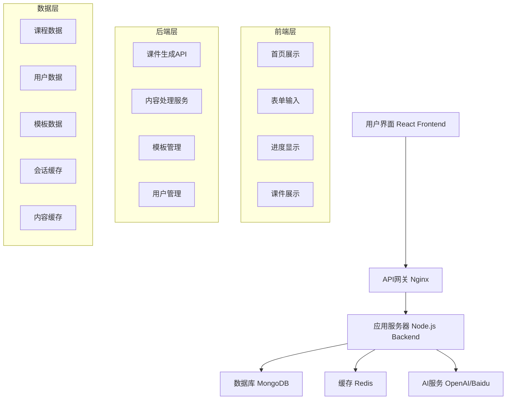

# 🎓 智能高中课件生成系统

<div align="center">


**自强不息，厚德载物**

一个基于AI的智能高中课件生成系统，支持9个学科的自动化课件制作

[🚀 在线体验](http://192.168.139.131) • [📖 文档](#文档) • [🛠️ 部署指南](#部署指南) • [🤝 贡献指南](#贡献指南)

</div>

---

## 📋 目录

- [设计目的](#设计目的)
- [核心功能](#核心功能)
- [系统架构](#系统架构)
- [技术栈](#技术栈)
- [快速开始](#快速开始)
- [部署指南](#部署指南)
- [API文档](#api文档)
- [功能展示](#功能展示)
- [开发指南](#开发指南)
- [贡献指南](#贡献指南)
- [许可证](#许可证)

## 🎯 设计目的

### 教育数字化转型
随着教育信息化的深入发展，传统的课件制作方式已无法满足现代教学的需求。本系统旨在：

- **🚀 提升教学效率**：通过AI自动生成课件，减少教师备课时间
- **📚 标准化教学内容**：基于权威教材，确保教学内容的准确性和完整性
- **🎨 丰富教学形式**：提供多媒体、交互式的教学内容
- **🌐 促进教育公平**：让优质教育资源惠及更多学生

### 技术创新应用
- **AI驱动**：利用人工智能技术实现智能内容生成
- **现代化架构**：采用前后端分离的现代Web架构
- **响应式设计**：支持多设备访问，适应不同教学场景
- **学术品质**：体现学术严谨性和技术先进性

## ✨ 核心功能

### 🎓 智能课件生成
- **9个学科支持**：语文、数学、英语、物理、化学、政治、历史、地理、生物
- **三个年级覆盖**：高一、高二、高三全覆盖
- **双册别支持**：上册、下册完整教学周期
- **AI内容生成**：自动生成课程概述、核心概念、重要公式、练习题目

### 📊 可视化教学
- **概念示意图**：质点模型、运动相对性等抽象概念的图形化展示
- **对比分析图**：不同参考系下的运动状态对比
- **交互式图表**：SVG矢量图，支持缩放和交互
- **响应式布局**：适配桌面、平板、手机等多种设备

### 🧪 教学辅助工具
- **易混点辨析**：常见误区识别和正确理解引导
- **快速自测**：交互式测试题目，即时反馈
- **历史名人简介**：物理学史话，增加学习趣味性
- **知识结构图**：系统化的知识点关联展示

### 🎨 用户体验优化
- **学术主题设计**：紫色渐变背景，体现学术氛围
- **进度条反馈**：生成过程可视化，提升用户体验
- **默认智能填充**：预设常用选项，简化操作流程
- **多格式导出**：支持PPT、PDF、HTML等多种格式

## 🏗️ 系统架构

### 整体架构图



### 技术架构层次

| 层次 | 技术选型 | 职责 |
|------|----------|------|
| **表现层** | React 18 + TypeScript + Tailwind CSS | 用户界面展示和交互 |
| **网关层** | Nginx | 反向代理、负载均衡、静态资源服务 |
| **应用层** | Node.js + Express + TypeScript | 业务逻辑处理、API服务 |
| **数据层** | MongoDB + Redis | 数据持久化和缓存 |
| **AI服务层** | OpenAI GPT-4 + 百度文心一言 | 智能内容生成 |

### 部署架构

```
┌─────────────────┐    ┌─────────────────┐    ┌─────────────────┐
│   Load Balancer │    │   Web Server    │    │  Application    │
│     (Nginx)     │───▶│    (Nginx)      │───▶│   (Node.js)     │
│                 │    │                 │    │                 │
└─────────────────┘    └─────────────────┘    └─────────────────┘
                                                        │
                       ┌─────────────────┐             │
                       │    Database     │◀────────────┘
                       │   (MongoDB)     │
                       │                 │
                       └─────────────────┘
                       ┌─────────────────┐
                       │     Cache       │
                       │    (Redis)      │
                       │                 │
                       └─────────────────┘
```

## 🛠️ 技术栈

### 前端技术栈
```json
{
  "framework": "React 18",
  "language": "TypeScript",
  "build": "Vite",
  "styling": "Tailwind CSS + Custom CSS",
  "animation": "Framer Motion",
  "http": "Axios",
  "routing": "React Router DOM",
  "icons": "Lucide React + Emoji"
}
```

### 后端技术栈
```json
{
  "runtime": "Node.js 16+",
  "framework": "Express",
  "language": "TypeScript",
  "database": "MongoDB + Mongoose",
  "cache": "Redis",
  "ai": "OpenAI GPT-4 + Baidu Wenxin",
  "process": "PM2",
  "security": "Helmet + CORS"
}
```

### 开发工具
```json
{
  "package_manager": "npm",
  "bundler": "Vite",
  "linter": "ESLint",
  "formatter": "Prettier",
  "testing": "Jest + React Testing Library",
  "deployment": "PowerShell Scripts + SSH"
}
```

## 🚀 快速开始

### 环境要求

- **Node.js**: >= 16.0.0
- **npm**: >= 8.0.0
- **MongoDB**: >= 4.4.0
- **Redis**: >= 6.0.0
- **操作系统**: Windows/Linux/macOS

### 本地开发

1. **克隆项目**
```bash
git clone https://github.com/your-org/courseware-generator.git
cd courseware-generator
```

2. **安装依赖**
```bash
# 安装根目录依赖
npm install

# 安装前端依赖
cd frontend && npm install

# 安装后端依赖
cd ../backend && npm install
```

3. **环境配置**
```bash
# 复制环境变量文件
cp backend/.env.example backend/.env

# 编辑环境变量
vim backend/.env
```

4. **启动服务**
```bash
# 启动完整开发环境
npm run dev

# 或分别启动
npm run dev:frontend  # 前端开发服务器
npm run dev:backend   # 后端开发服务器
```

5. **访问应用**
- 前端: http://localhost:5173
- 后端API: http://localhost:3000
- API文档: http://localhost:3000/api-docs

## 📦 部署指南

### 生产环境部署

#### 1. 服务器准备
```bash
# CentOS 7 环境
sudo yum update -y
sudo yum install -y nodejs npm nginx mongodb-server redis

# 启动服务
sudo systemctl start mongod redis nginx
sudo systemctl enable mongod redis nginx
```

#### 2. 项目部署
```bash
# 克隆项目到服务器
git clone https://github.com/your-org/courseware-generator.git
cd courseware-generator

# 构建项目
npm run build

# 配置PM2
npm install -g pm2
pm2 start ecosystem.config.js
pm2 save
pm2 startup
```

#### 3. Nginx配置
```nginx
server {
    listen 80;
    server_name your-domain.com;
    
    location / {
        root /var/www/courseware-generator/frontend/dist;
        try_files $uri $uri/ /index.html;
    }
    
    location /api {
        proxy_pass http://localhost:3000;
        proxy_set_header Host $host;
        proxy_set_header X-Real-IP $remote_addr;
    }
}
```

#### 4. 自动化部署脚本
```powershell
# Windows PowerShell 部署脚本
.\deploy-enhanced-courseware.ps1
```

### Docker部署

```dockerfile
# Dockerfile
FROM node:16-alpine

WORKDIR /app
COPY package*.json ./
RUN npm ci --only=production

COPY . .
RUN npm run build

EXPOSE 3000
CMD ["npm", "start"]
```

```yaml
# docker-compose.yml
version: '3.8'
services:
  app:
    build: .
    ports:
      - "3000:3000"
    depends_on:
      - mongodb
      - redis
  
  mongodb:
    image: mongo:4.4
    ports:
      - "27017:27017"
  
  redis:
    image: redis:6-alpine
    ports:
      - "6379:6379"
```

## 📚 API文档

### 基础信息
- **Base URL**: `http://your-domain.com/api`
- **认证方式**: Bearer Token (可选)
- **数据格式**: JSON
- **字符编码**: UTF-8

### 核心接口

#### 1. 健康检查
```http
GET /api/health
```

**响应示例**:
```json
{
  "status": "ok",
  "message": "智能高中课件生成系统运行正常",
  "version": "2.0.0",
  "timestamp": "2025-07-29T12:00:00.000Z"
}
```

#### 2. 获取学科列表
```http
GET /api/subjects
```

**响应示例**:
```json
[
  {"id": "chinese", "name": "语文", "icon": "📚"},
  {"id": "math", "name": "数学", "icon": "🔢"},
  {"id": "physics", "name": "物理", "icon": "⚛️"}
]
```

#### 3. 生成课件
```http
POST /api/generate
Content-Type: application/json

{
  "subject": "physics",
  "grade": "grade1",
  "volume": "volume1",
  "title": "运动的描述 - 质点与参考系"
}
```

**响应示例**:
```json
{
  "success": true,
  "message": "课件生成成功",
  "data": {
    "id": "1753758860860",
    "subject": "physics",
    "grade": "grade1",
    "volume": "volume1",
    "title": "运动的描述 - 质点与参考系",
    "content": {
      "overview": "物体的空间位置随时间的变化...",
      "concepts": ["机械运动", "质点", "参考系"],
      "formulas": ["物体能否看作质点 = f(研究问题的需要)"],
      "diagrams": ["质点模型示意图", "运动相对性对比图"],
      "exercises": ["判断质点应用条件", "参考系选择分析"]
    },
    "university": "Academic Institution",
    "motto": "自强不息，厚德载物",
    "createdAt": "2025-07-29T12:00:00.000Z"
  }
}
```

## 🎨 功能展示

### 首页展示
<div align="center">
  
  <p><em>紫色主题设计，展示9个学科和学术建筑元素</em></p>
</div>

### 课件生成流程
<div align="center">
  
  <p><em>表单填写 → 进度条 → 课件展示的完整流程</em></p>
</div>

### 课件内容展示
<div align="center">
  
  <p><em>包含概念图解、易混点辨析、历史名人简介等丰富内容</em></p>
</div>

## 👨‍💻 开发指南

### 项目结构
```
courseware-generator/
├── frontend/                 # React前端应用
│   ├── src/
│   │   ├── components/      # React组件
│   │   ├── pages/          # 页面组件
│   │   ├── hooks/          # 自定义Hooks
│   │   ├── utils/          # 工具函数
│   │   └── types/          # TypeScript类型定义
│   ├── public/             # 静态资源
│   └── dist/               # 构建输出
├── backend/                 # Node.js后端应用
│   ├── src/
│   │   ├── controllers/    # 控制器
│   │   ├── services/       # 业务逻辑
│   │   ├── models/         # 数据模型
│   │   ├── routes/         # 路由定义
│   │   └── utils/          # 工具函数
│   └── dist/               # 构建输出
├── shared/                  # 共享类型和工具
├── docs/                   # 文档和图片
├── scripts/                # 部署和工具脚本
└── tests/                  # 测试文件
```

### 开发规范

#### 代码风格
- **TypeScript**: 严格模式，完整类型注解
- **ESLint**: 使用推荐规则集
- **Prettier**: 统一代码格式
- **命名规范**: camelCase (变量/函数), PascalCase (组件/类)

#### Git工作流
```bash
# 功能开发
git checkout -b feature/new-feature
git commit -m "feat: add new feature"
git push origin feature/new-feature

# 提交PR进行代码审查
# 合并到main分支后自动部署
```

#### 测试策略
```bash
# 单元测试
npm run test:unit

# 集成测试
npm run test:integration

# E2E测试
npm run test:e2e

# 测试覆盖率
npm run test:coverage
```

### 常用命令

```bash
# 开发环境
npm run dev              # 启动完整开发环境
npm run dev:frontend     # 仅启动前端
npm run dev:backend      # 仅启动后端

# 构建
npm run build            # 构建整个项目
npm run build:frontend   # 仅构建前端
npm run build:backend    # 仅构建后端

# 测试
npm run test            # 运行所有测试
npm run test:watch      # 监视模式运行测试
npm run test:coverage   # 生成测试覆盖率报告

# 代码质量
npm run lint            # 代码检查
npm run lint:fix        # 自动修复代码问题
npm run format          # 格式化代码

# 部署
npm run deploy:staging  # 部署到测试环境
npm run deploy:prod     # 部署到生产环境
```

## 🤝 贡献指南

我们欢迎所有形式的贡献！无论是bug报告、功能建议、代码贡献还是文档改进。

### 如何贡献

1. **Fork项目** 到你的GitHub账户
2. **创建功能分支** (`git checkout -b feature/AmazingFeature`)
3. **提交更改** (`git commit -m 'Add some AmazingFeature'`)
4. **推送到分支** (`git push origin feature/AmazingFeature`)
5. **创建Pull Request**

### 贡献类型

- 🐛 **Bug修复**: 修复现有功能的问题
- ✨ **新功能**: 添加新的功能特性
- 📚 **文档**: 改进文档和示例
- 🎨 **UI/UX**: 改进用户界面和体验
- ⚡ **性能**: 优化性能和效率
- 🔧 **工具**: 改进开发工具和流程

### 代码贡献规范

#### Commit消息格式
```
<type>(<scope>): <subject>

<body>

<footer>
```

**类型 (type)**:
- `feat`: 新功能
- `fix`: Bug修复
- `docs`: 文档更新
- `style`: 代码格式调整
- `refactor`: 代码重构
- `test`: 测试相关
- `chore`: 构建过程或辅助工具的变动

**示例**:
```
feat(courseware): add physics courseware generation

- Add support for physics subject
- Include concept diagrams and historical figures
- Implement interactive quiz functionality

Closes #123
```

### 问题报告

使用GitHub Issues报告问题时，请包含：

- **环境信息**: 操作系统、浏览器版本、Node.js版本
- **重现步骤**: 详细的操作步骤
- **期望行为**: 你期望发生什么
- **实际行为**: 实际发生了什么
- **截图**: 如果适用，添加截图说明问题

### 功能请求

提交功能请求时，请说明：

- **功能描述**: 详细描述所需功能
- **使用场景**: 什么情况下会用到这个功能
- **预期收益**: 这个功能能带来什么价值
- **实现建议**: 如果有想法，可以提供实现建议

## 📄 许可证

本项目采用 MIT 许可证 - 查看 [LICENSE](LICENSE) 文件了解详情。

```
MIT License

Copyright (c) 2025 Courseware Generator Team

Permission is hereby granted, free of charge, to any person obtaining a copy
of this software and associated documentation files (the "Software"), to deal
in the Software without restriction, including without limitation the rights
to use, copy, modify, merge, publish, distribute, sublicense, and/or sell
copies of the Software, and to permit persons to whom the Software is
furnished to do so, subject to the following conditions:

The above copyright notice and this permission notice shall be included in all
copies or substantial portions of the Software.

THE SOFTWARE IS PROVIDED "AS IS", WITHOUT WARRANTY OF ANY KIND, EXPRESS OR
IMPLIED, INCLUDING BUT NOT LIMITED TO THE WARRANTIES OF MERCHANTABILITY,
FITNESS FOR A PARTICULAR PURPOSE AND NONINFRINGEMENT. IN NO EVENT SHALL THE
AUTHORS OR COPYRIGHT HOLDERS BE LIABLE FOR ANY CLAIM, DAMAGES OR OTHER
LIABILITY, WHETHER IN AN ACTION OF CONTRACT, TORT OR OTHERWISE, ARISING FROM,
OUT OF OR IN CONNECTION WITH THE SOFTWARE OR THE USE OR OTHER DEALINGS IN THE
SOFTWARE.
```

## 🙏 致谢

感谢所有为这个项目做出贡献的开发者和用户！

### 核心贡献者
- **项目负责人**: AI Development Team
- **前端开发**: React Development Team
- **后端开发**: Node.js Development Team
- **UI/UX设计**: Design Team
- **测试团队**: QA Team

### 特别感谢
- [React](https://reactjs.org/) - 用户界面库
- [Node.js](https://nodejs.org/) - JavaScript运行时
- [MongoDB](https://www.mongodb.com/) - 文档数据库
- [Tailwind CSS](https://tailwindcss.com/) - CSS框架
- [OpenAI](https://openai.com/) - AI服务支持

### 支持与反馈

- 📧 **邮箱**: support@courseware-generator.com
- 💬 **讨论**: [GitHub Discussions](https://github.com/your-org/courseware-generator/discussions)
- 🐛 **问题报告**: [GitHub Issues](https://github.com/your-org/courseware-generator/issues)
- 📖 **文档**: [项目Wiki](https://github.com/your-org/courseware-generator/wiki)

---

<div align="center">

**🎓 智能高中课件生成系统**

*让优质教育资源惠及每一个学生*

[](https://github.com/your-org/courseware-generator/stargazers)
[](https://github.com/your-org/courseware-generator/network/members)
[](https://github.com/your-org/courseware-generator/issues)

Made with ❤️ by Development Team

</div>